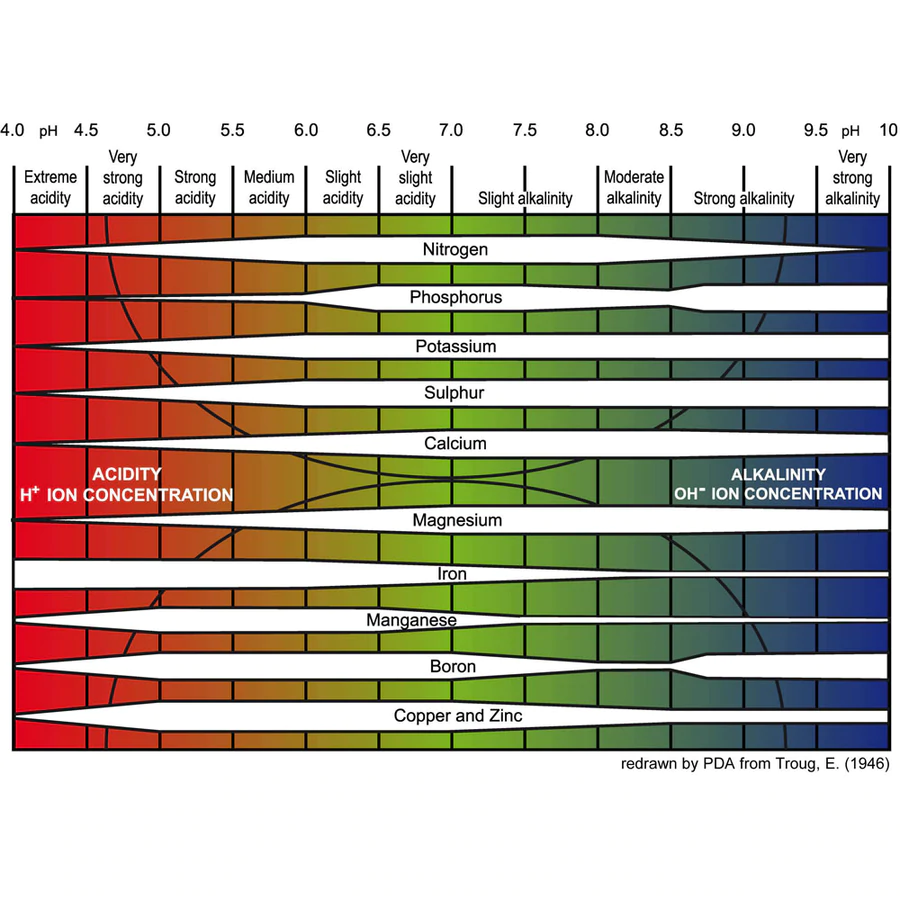
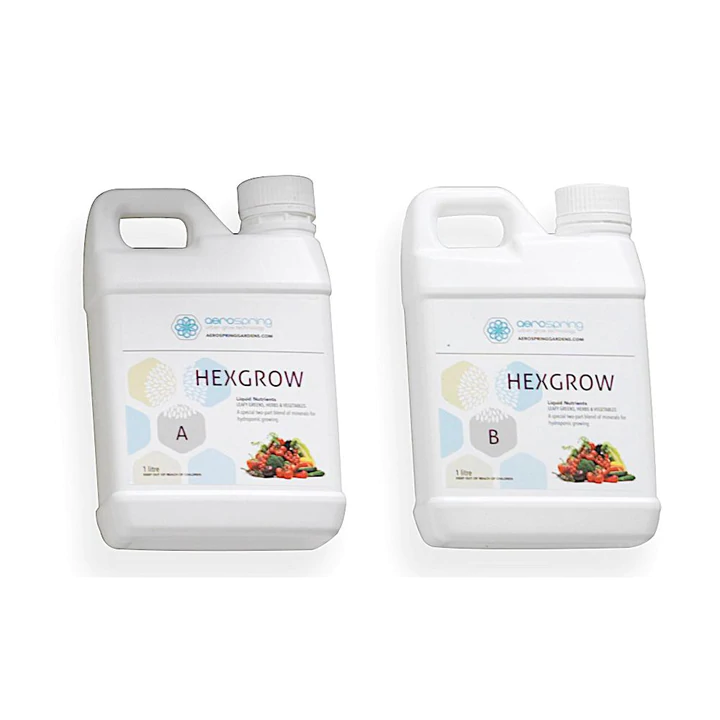
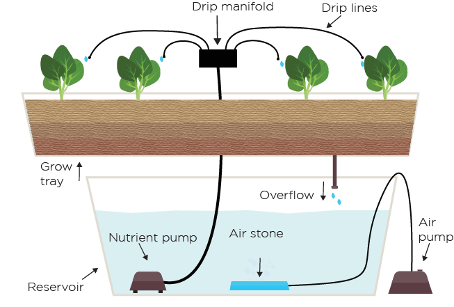
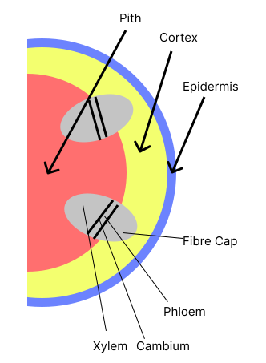
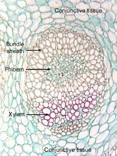
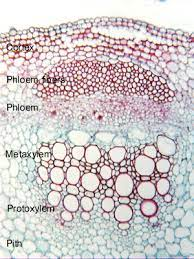
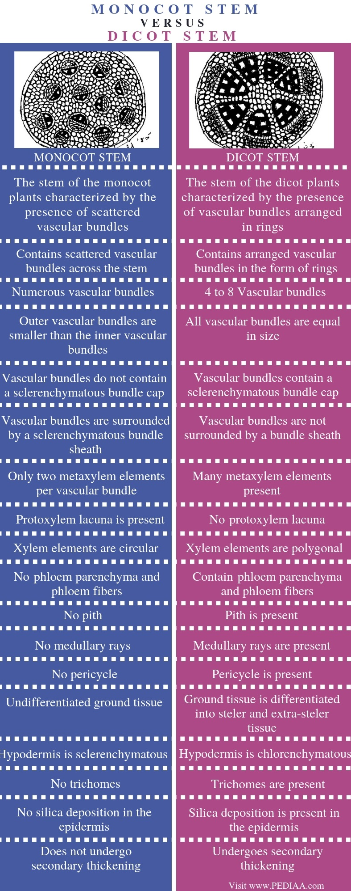
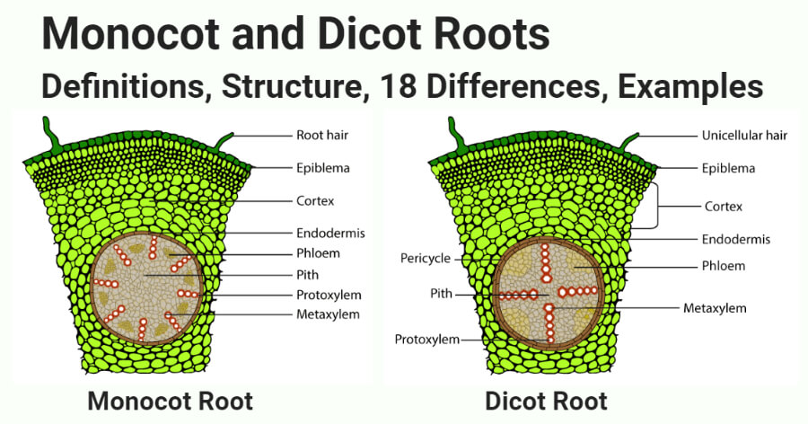

# 2022 MYE Life Sciences Notes

Note: This is meant to be complementary to the Notes, Theory, Practical books, and E-Resources like Answers, Slides, etc.

 

Please open a pull request if you spot a error in content or a typo. 

### Contents:
  1. [Enzymes](#1-enzymes)
  2. [Cellular Transport](#2-cellular-transport)
  3. [Nutrition in Plants](#3-nutrition-in-plants)
  4. [Seed Structure and Germination](#4-seed-structure-and-germination)
  5. [Hydroponics](#5-hydroponics)
  6. [Plant Transport](#6-plant-transport)

## 1. Enzymes

Proteins: Made of interlinked `chains of amino acids` (Polypeptide)

Biological Catalysts: Decreases the activation energy of the reaction, meaning that the reaction will still proceed without enzymes, just *much* slower.

Lock and Key Hypothesis: Substrate must collide and fit perfectly with the active site

Induced Fit Model: Substrate is capable of inducing the proper alignment of the active site of the enzyme

Why organisms use enzymes: We need to speed up life processes, and we can increase the temperature to do that. However, that requires much more energy to sustain that temperature, can damage cells, and also speeds up non-useful reactions. Thus, we use enzymes that reduce the activation energy of the reaction.

Quick Note: Protease refers to enzymes which break down protein such as bromelain (pineapple), and pepsin.

Quick Note: Lactose intolerant persons lack enough lactase to break down the lactose they injest.

Example:

Starch (Substrate) [Complex Carbohydrate] => Iodine test appears as *blue-black*.

OR

Starch (Substrate) [Complex Carbohydrate] => Using Amylase => Maltose => Using Maltase => Glucose => Iodine test appears as *brown*.

Enzyme Inhibitors: 

Many medicines contain these. They can be broken down into competitve and non-competitive inhibitors. 

Competitive Inhibitors:

- Binds to the active site of enzyme so that the substrate is unable to bind to the enzyme
- Does *not* change the shape of the active site but changes the shape *available* for the substrate to bind to

- Statins (Cholestrol Reduction - Block the production of cholestrol)

Non-Compeitive Inhibitors:

- Binds to other parts of the enzyme so that the substrate is unable to bind to the enzyme 
- Changes the shape of the enzyme and its active site 

- Cyanide (Kills - Blocks the synthesis of ATP)
- Arsenic
- Heavy Metals
- Salt (On Bromelain)

## 2. Cellular Transport

Quick Note: Net means overall movement. This means that particles still move between the two areas, but there is overall no change in concentration of that particle in the two areas. This applies for both diffusion and osmosis.

Diffusion Example 1 - Plant in the day:

CO2 - Atmosphere => Intra-Cellular Airspaces within the leaf

O2 - Intra-Cellular Airspaces => Atmosphere

Diffusion Example 2: Plant in the night:

CO2 - Intra-Cellular Airspaces => Atmosphere within the leaf

O2 - Atmosphere => Intra-Cellular Airspaces

Diffusion Example 3 - Human Lungs:

CO2 - Bloodstream => Air (Airsac)

O2 - Air (Airsac) => Bloodstream

Written out:

Faster rate of photosynthesis than respiration on bright afternoon so higher concentration of oxygen and lower concentration of carbon dioxide occurs in the leaf intracellular air-space compared to the exterior atmosphere. [1]
Thus, there is diffusion of carbon dioxide into the air-space through the stomata down the concentration gradient. [1]

Facilitated Diffusion Example 1:

When Glucose and Amino Acids digested from food are higher in concentration in the small intestine than the bloodstream, they travel through the walls into the bloodstream through facilitated diffusion because they are still quite big.

Active Transport Example 1:

When Glucose and Amino Acids digested from food are lower in concentration in the small intestine than the bloodstream, they travel through the walls into the bloodstream through active transport.

Active Transport Example 2:

Nutrients travel from the soil into the root (hair cells) through active transport as there is a high concentration of cell sap (mineral salts and sugar) in the vacuole. This ensures a low water potential within cells to facilitate the intake of water by osmosis. However, it means that active transport must be used to take in nutrients.

---

Diffusion is usually the most "diverse" and can occur in liquids, gas, semi-solids (agar), with or without a partially-permeable membrane, since it is not a live process (like F.D. and A.C. which inherently require live stuff). 

Facilitated Diffusion is also suited for bringing *large and charged particles like ions* across the cell membrane, using *protein channels*.

Active transport functions like a pump, thus it needs ATP. It uses *transport carrier proteins* to bring *large and charged* particles across the membrane. These could be *ions in the nerves* to send signals. They could also be *ionic sodium and potassium*, pumping Na+ out of the cell and K+ into the cell, against the concentration gradient. 
A.T. ensures *electrostatic equilibrium*.

The carrier protein is a molecule which forms a *carrier-ion complex* with the ion. It binds with the specific solute to be transported and undergoes a series of conformational changes to transfer the bound solute across the membrane

---

Factors affecting the rate of diffusion/osmosis *(Passive Processes)*

- Temperature

As the temperature increases,the rate of the process increases. Molecules move faster when temperature increases hence leading to a faster rate of diffusion/osmosis.

- Concentration Gradient Difference

As the concentration gradient increases,the rate of the process increases. More molecules will be crossing over the regions hence leading to a faster rate of diffusion/osmosis.

- Surface Area to Volume Ratio

As the surface area to volume ratio increases,the rate of the process increases. More surface area and shorter distance for particle to move from inside of cell to outside of cell and vice versa, hence leading to a faster rate of diffusion/osmosis.

- Distance

The distance that the particles have to travel affect the rate of process, for example if the room is bigger, it will take longer for a smell to diffuse throughout the room.

- Characteristics of Solvent

Eg. Molecular Weight or Viscosity

- Characteristics of Substance

Eg. Molecular Weight

- Characteristics of Barrier

Eg. Polar or Non-Polar, Thickness

---

The definition of osmosis is already in the book together with the table so...

The presence of a partially permeable membrane restricts diffusion of solute particles (sodium ions). Osmosis will occur instead, where water molecules move from a less concentrated solution (pure water) to a more concentrated solution (sodium solution) to "balance" out the water to solute ratio. 

This means that if there was no *partially-permeable membrane*, the sodium ions would simply diffuse throughout the solution, which is why we say that *osmosis requires a partially-permeable membrane*.
 

In the sodium solution, water molecules are held around the sodium ions, giving it "less potential" to move around the solution. In pure water however, water molecules move around more freely and therefore has "more potential". Hence, water molecules move from an area of higher water potential to an area of lower water potential. 
 
The more concentrated a solution is, the lower its water potential. So:

Low Solute Concentration => High Water "Concentration" => High Water Potential

High Solute Concentration => Low Water "Concentration" => Low Water Potential

Quick Note: We must always say that something is hypertonic **to** or hypotonic **to** something else.

Animal Cells Terms:
1. Shrunken/Crenated
2. Normal (Best)
3. Swell and Burst/Lyse

Plant Cells Terms:
1. Plasmolysis (Occurs when  cell *membrane* pulls away from the cell wall)
2. Flaccid (Occus when cell *contents* pull away from cell wall)
3. Turgid (Best)

## 3. Nutrition in Plants

Quick Note: The *duration* of light mainly affects the initation of flowering. Long-Day Plants such as wheats and oats only bloom when the duration of light they receive is more than 12 hours or the critical period. Short-Day Plants such as tobacco, soybeans and chrysanthemum only bloom when the duration of light they receive is less than 12 hours or the critical period. There are also day-neutral plants like tomatoes, maize (corn), cucumbers, sunflowers and some strawberries which form flowers regardless of day length.

Quick Note: Three aspects of light - Quality (Wavelength), Intensity (Brightness), Duration (Photoperiod).

Quick Note: In the lab, the reason why magenta lights are usually used is because red and blue is best utilised by plants for photosynthesis. Green is least-utilised because most of it is reflected (That is why the leaves look green).

| Germination [Seed]                                      | Condition   | Growth [Plant]                                          |
|---------------------------------------------------------|-------------|---------------------------------------------------------|
| ~ (Some are affected, some aren't)                      | Light       | ✔️ (Photosynthesis)                                      |
| ✔️ (Make Enzymes Work)                                   | Water       | ✔️ (Photosynthesis)                                      |
| ❌ (Cotyledon is Present)                                | Nutrients   | ✔️ (Active Transport)                                    |
| ✔️ (Cellular Respiration)                                | Oxygen      | ✔️ (Cellular Respiration)                                |
| ✔️ (*Enzymes* for Cellular Respiration) | Temperature | ✔️ (*Enzymes* for Cellular Respiration and Photosynthesis, as well as Transpiration) |

<!--https://www.tablesgenerator.com/markdown_tables-->

| Nutrient Type            | Examples                                                           | Elemental Symbol                              | Purpose                                                               |
|--------------------------|--------------------------------------------------------------------|-----------------------------------------------|-----------------------------------------------------------------------|
| Primary Macronutrients   | **Nitrogen**, Phosphorus, Potassium                                | N, P, K                                       | Proteins, Nucleic Acids, Etc.                                         |
| Secondary Macronutrients | Calcium, Magnesium, Sulfur                                         | Ca, Mg, S                                     | Cellular Development                                                  |
| Micronutrients           | Boron, Iron, Chlorine, Zinc, Manganese, Copper, Molybdenum, Nickel | B, Fe, Cl, Zn, Mn, Cu, Mo, Ni                 | [Link](https://en.wikipedia.org/wiki/Plant_nutrition#Micro-nutrients) |
| Non-Mineral Nutrients    | **Carbon**, **Hydrogen**, **Oxygen**                               | C, H, O  H2O, CO2 | Photosynthesis (Water, Carbon Dioxide)                                |

All these nutrients are necessary, just needed in different amounts.

Mineral nutrients are taken in through the process of active transport by the root hair cells.

What each primary macronutrient does and its characteristics (In addition to stuff in the notes booklet):

Nitrogen:
- Dark green, glossy look
- Easily leaves the soil
- Mobile in plants

Phosphorus:
- Root formation and growth
- Quality of Seed, Fruits and Flowers
- Disease Resistance

Potassium:
- Overcome drought stress
- Winter Hardness
- Disease Resistance
- Strength of Stems

## 4. Seed Structure and Germination

Flowering plants can be split into monocotyledonous plants and dicotyledonous plants. (Non-flowering plants obviously don't make seeds).

Monocotyledonous Plants:
- wheat
- asparagus
- corn (maize)
- rice
- millet
- lilies
- daffodils
- sugarcane
- banana
- palm
- ginger
- onions
- bamboo
- sugarcane
- cone
- palm tree
- banana tree
- grass

Dicotyledonous Plants:
- soybean
- broad bean
- peas
- almonds
- cashews
- grapes
- apples
- chestnut
- oak
- carrot
- rose
- hollyhock

The cotyledons provide nourishment for the germinating plant.

A seed can be broken down into three main parts, the embryo, the seed coat, and the cotyledon.

The embryo is the living thing, that will grow into a plant.

From the "top-down", a embryo consists of
1. Plumule - The part that becomes the shoot
2. Epicotyl (Above)
3. Hypocotyl (Below)
4. Radicle - Attracted by gravity, becomes the root.

The seedcoat consists of
1. Outer testa (Hard and Thick)
2. Inner tegmen (Thin Whitish Membrane)
which are fused.

Usually we refer to the seedcoat as the testa. It protects the embryo.

The cotyledons in a dicotyledonous plant are connected along an embryonic axis, which consists of the
1. Raphe (The line or scar running across the seed)
2. Micropyle (Pore, usually below the hilum)
3. Hilum (Attachment to the original plant's ovary wall)

## 5. Hydroponics

Why the optimum pH is 5.8-6.5.

Example Nutrient Solution You Can Buy

---

Extra: Root Dripping System

The above is usually a closed system.

--- 

Quick Note: Regular replacement of nutrient solution in the open system refers to replacing the whole nutrient solution at every growth cycle, harvest, or every few weeks.

Quick Note: The air stone's job is to **disperse** oxygen *from* the air pump.

Quick Note: Aeroponics is classified as a closed system because the nutrient solution (mist) is collected and reused (sprayed).

---

Additional Disadvantages of a Closed System not Mentioned in the Book:

(I know this is random and out of nowhere but whatever, good to know)

- Failure of pump system leads to plant death very quickly
- Introduction of pathogens leads to disease infecting all plants quickly

---

Additional Advantages to **Hydroponics as a Whole**:
- Faster Growth and Greater Harvests
- Nutrients used can be adjusted to the exact needs of the plant
- Plants flourish as they absorb water and nutrients much more efficiently (It's even better in aeroponics)

---

Extra: Why soil was originally always used:
- Anchors plant from above-ground hazards
- Nutrients inherently present in the soil
- Water inherently present as rainwater and groundwater
- Aeration of roots inherently present due to space between soil particles

## 6. Plant Transport

The "*atas*" version of this is also called the *vascular system*.

<!--yeah im singaporean what you gonna do about it huh-->

As we learnt in the "organisation of life":

1. Atoms
2. Molecules
3. Macromolecules
4. Organelles
5. Cells
6. Tissues
7. Organs
8. Organ System
9. Organism
10. Population
11. Community
12. Ecosystem
13. Biome
14. Biosphere

In plants, there are 3 main organs:
1. Leaves
2. Stem
3. Roots

In these three organs, there are two tissues:
1. Xylem Vessels - Water, (Dissolved) Mineral Salts
2. Phloem Tubes - Sucrose (sometimes Glucose) [Carbohydrate], Amino Acids (Made from Nitrates)

Additional Notes on Phloem:

The cambium is a tissue layer that provides partially undifferentiated cells for plant growth. It is found in the area between xylem and phloem. It is really thin so you can't really see it. Meanwhile, the phloem is actually not the fibre cap like it is confused to be.

---

Additional Notes on Xylem:

- In a dicot stem, it is pointing to the centre
- It is more symmetrical
- It has lignin (complex organic polymer) to make it tough
- It is impermeable to H2O
- One-Way Flow (Unidirectional)
- Close to the edge in a stem to keep it tough and straight
- Centred in root to keep it rooted
- Consists of a variety of specialized, water-conducting cells known as tracheary elements - tracheids and vessels

Quick Note: Xylem is usually on the top in a leaf

3 Causes of Movement of Water:

1. Root Pressure

Caused by the inward osmosis of water into the root hair cells, turning these cells from flaccid to turgid, then the water moves up, then the cells turn flaccid again, and the cycle repeats.

2. Capillary Action

This is caused because water likes to stick to surfaces and the tracheary elements are water-conducting.
This accounts for the least amount of water movement in the xylem.

3. Transpiration Pull

This is like a vacuum, like a stream of sucking water up.

In the day, sugar made by leaves go into the guardcells and causes their water potential to lower. This causes water to flow in and the guard cell turns turgid. Then, the turgid guard cell fattens up and causes the stoma to open. This then allows for transpiration to happen, which is the loss of water from the plant through evaporation at the leaf surface through the stomata. 
This is the main driver of water flow up the xylem.

Additional Factors Affecting Rate of Transpiration:
- Whether the leaf if folded
- Size of leaf - Number, Area/Size of Stoma

*Differences* Between *Vascular System* in the **STEM** of *monocot and dicot*:

- Presence of Vascular Cambium

Monocots do not have a vascular cambium. Instead, they have a thickening meristem that produces secondary ground tissue.

Dicots have a vascular cambium, a layer of cells dividing the xylem and phloem. It is tissue which provides partially undifferentiated cells for plant growth.

- Distribution of Vascular Bundles

In a Monocot, vascular bundles are scattered throughout the stem, while in a dicot, vascular bundles are arranged in a neat and organised ring, pointing towards the centre from the edge.

*Differences* Between *Vascular System* in the **ROOT** of *monocot and dicot*:

- Root systems

Monocot roots are fibrous, meaning they form a wide network of thin root fibres that originate from the stem and stay close to the surface of the soil. In contrast, dicots have “taproots,” meaning they form a single thick root from which secondary and tertiary roots develop and grow vertically downwards through the soil. It grows deep into the soil and has smaller, lateral branches. 

- Cortex

The cortex in a monocot root is wider than in a dicot root with a narrow cortex.

The cortex in monocot roots is composed of only parenchymatous cells while the cortex of dicot roots is composed of both parenchymatous and sclerenchymatous cells.

- Endodermis

The endodermis of monocot roots is thicker.	The endodermis of dicot roots is less thick.

- Cambium

Both cork cambium and vascular cambium are absent in monocot roots while both cork cambium and vascular cambium are found in dicot roots.

- Parenchyma (Pith)

Xylem parenchyma is present in monocot roots while xylem parenchyma is absent in dicot roots.

The pith in monocot roots is developed and prominent.	The pith in dicot roots is less developed or reduced.

Reference:

- https://microbenotes.com/monocot-and-dicot-roots/